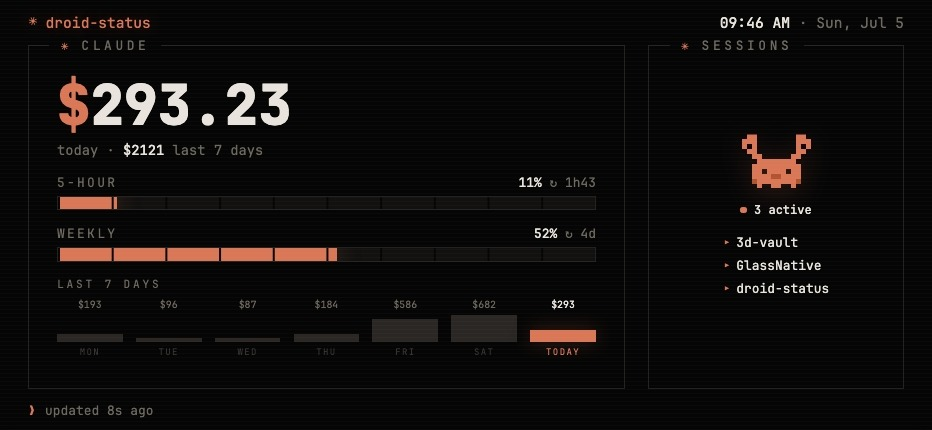

<!--
  Setup and operations guide for droid-status. Code lives in server.js +
  lib/ + public/index.html; the design rationale is in
  docs/superpowers/specs/2026-07-05-droid-status-design.md. This file covers
  the parts that AREN'T code: config, the Slack app/token, installing the
  launchd service, and configuring the phone (Fully Kiosk).
-->

# droid-status

Turn a spare Android phone into a desk kiosk for your Claude Code usage:
today's spend, the 5-hour and weekly rate-limit bars (with a "cap by ~HH:MM"
forecast when you're burning too fast), a 7-day cost chart, and which
projects have active sessions right now — plus optional Slack unread counts.
Served from your Mac over LAN; the phone just runs a browser.



macOS-only by design: it reads Claude Code's local transcripts, uses
[ccusage](https://github.com/ryoppippi/ccusage) for cost data, and pulls the
rate-limit numbers with the Claude Code OAuth token from the macOS Keychain
(read on demand, never stored, never refreshed).

## Requirements

- macOS with [Claude Code](https://claude.com/claude-code) installed and logged in
- Node.js 20+ and `ccusage` on your PATH
- A spare Android phone on the same Wi-Fi

## Run

```
npm start            # ad hoc (dev)
npm test
./deploy/install.sh  # install as a launchd service: starts at login,
                     # restarts on crash, logs to ~/Library/Logs/droid-status.log
```

Open `http://<mac-lan-ip>:4321` — add `?mock=1` for sample data while
tweaking the UI. The server binds a fixed port (4321, change in
`config.json`) because the phone needs a stable URL. Give your Mac a static
DHCP lease in your router so the IP never drifts; if your Mac uses a private
Wi-Fi address, set it to "Fixed" (System Settings → Wi-Fi → Details) so the
lease keeps matching.

## Config (optional)

```
cp config.example.json config.json
```

`config.json` is gitignored; without it the server runs on defaults and the
Slack pane stays parked.

### Slack unreads

1. https://api.slack.com/apps → **Create New App → From a manifest**, pick
   your workspace, paste:

   ```yaml
   display_information:
     name: droid-status
   oauth_config:
     scopes:
       user:
         - channels:read
         - groups:read
         - im:read
         - mpim:read
   settings:
     org_deploy_enabled: false
   ```

2. **Install to Workspace**, approve, copy the **User OAuth Token** (`xoxp-…`).
3. Put it in `config.json` → `slackUserToken` and restart the server.

## Phone: Android (Fully Kiosk Browser)

1. Install **Fully Kiosk Browser** (free tier is enough).
2. Start URL: `http://<mac-lan-ip>:4321`.
3. Recommended settings:
   - Keep Screen On: on, brightness ~40%
   - Screen Off Timer / Schedule: off overnight
   - Auto Reload on Errors + on Idle: on
   - Device Management → Launch on Boot: on
4. On MIUI/Xiaomi: give Fully Kiosk the Autostart permission and set battery
   saver to "No restrictions", or MIUI will kill it.
5. Plug the phone in permanently.

## Phone: iPhone / iPad

The display side is just a browser, so an old iPad makes an excellent kiosk.
There's no Fully Kiosk on iOS; the equivalent setup:

1. Open `http://<mac-lan-ip>:4321` in Safari → Share → **Add to Home Screen**.
   The page ships PWA meta tags, so it launches chrome-less and full-screen
   with a pixel-Clawd icon.
2. Settings → Display & Brightness → **Auto-Lock: Never**.
3. Optional but recommended: **Guided Access** (Settings → Accessibility) to
   pin the device to the dashboard — triple-click the side button to start.
4. Keep it plugged in.

OLED phone? The page is already true-black; consider a nightly screen-off
schedule. LCD? Burn-in is a non-issue.
